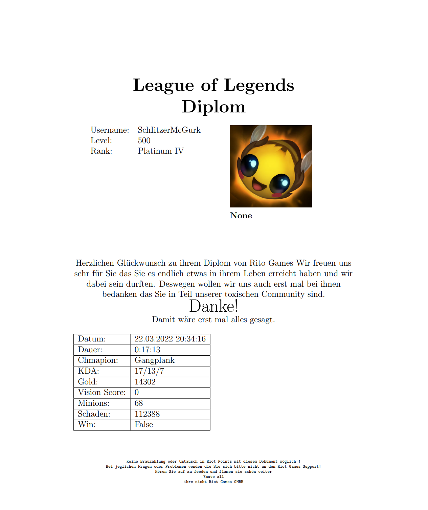

# Generate a League of Legends Diplom
Generate a League of Legends Diplom from your last Classic or Aram match.

### Installation
[pdflatex](https://miktex.org/download) with the following packages are required 
``
amsmath,
amsfonts,
multicol,
amssymb,
graphicx,
``
and a Riot Developer Api key must be set as [Environment Variable](https://www.twilio.com/blog/2017/01/how-to-set-environment-variables.html) ``RIOT_API_KEY=<Your Key>``

Clone the repository `git clone https://github.com/Plutokekz/LeagueDiplom.git` and
install the requirements `pip install -r requirements.txt`. Now you can run it.
```
python .\main.py -h                                           
usage: main.py [-h] [-n NAME] [-o OUTPUT]

Generating a League of Legends Diplom from a Summonername

optional arguments:
  -h, --help                  show this help message and exit
  -n NAME, --name NAME        the summoner name to generate the diplom of
  -o OUTPUT, --output OUTPUT  output directory for the pdf
```